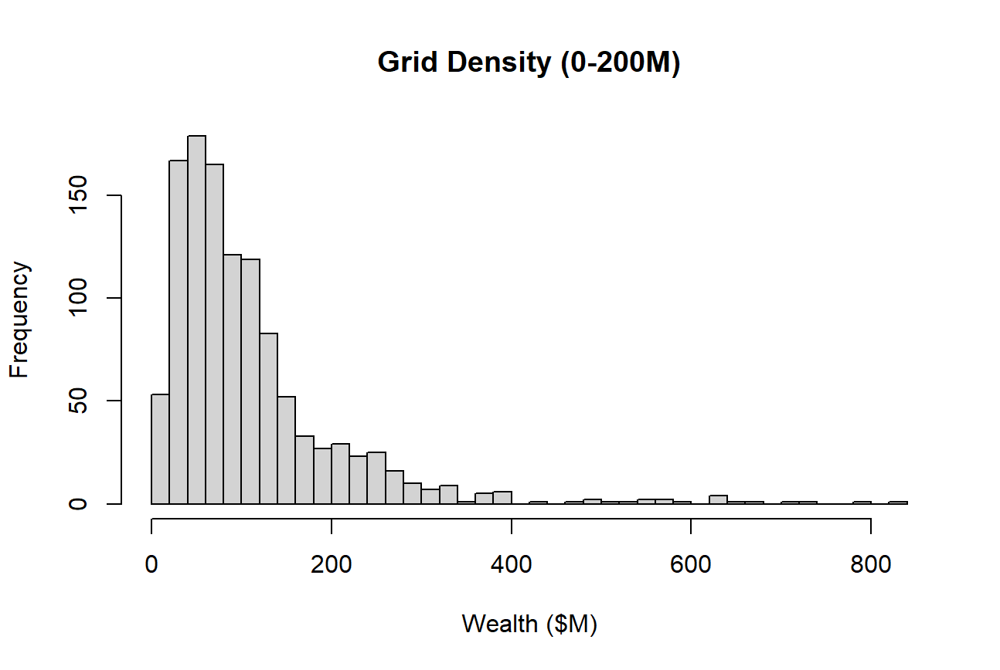
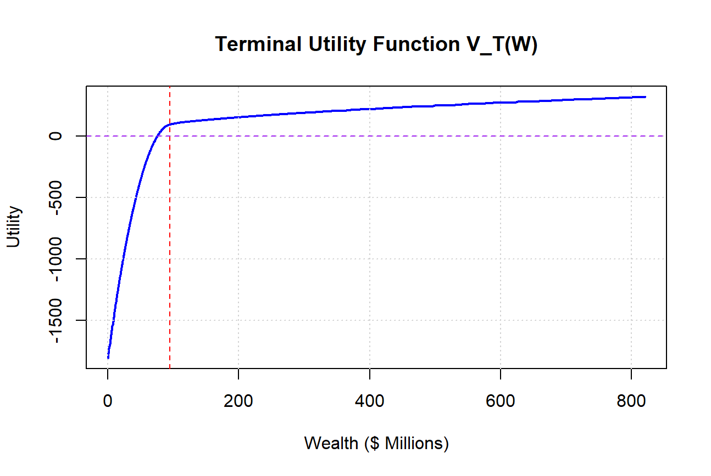
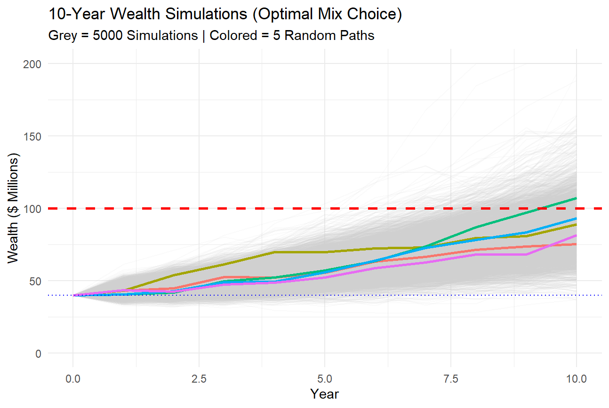
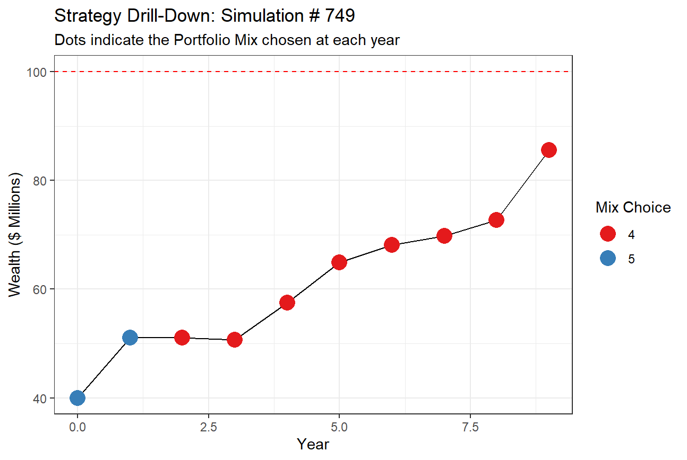

# Multi-Stage Asset Allocation and Portfolio Optimization: The $100M Foundation Campaign

## Project Overview
This project focuses on developing a 10-year strategic asset allocation model to grow the portfolio's assets from $40 million to $100 million in a  10-year horizon while managing annual spending and earning cash flows.

## The Challenge
The foundation faces a complex optimization problem:
* **Horizon:** 10-year investment period.
* **Cash Flows:** Annual spending and earnings, there are uncertain/unknown donations possible.
* **Wealth Targets:** Instead of maximizing the wealth, there is a highly non-linear, piecewise utility function. It turns the problem into a non-linear and stochastic optimization problem
* **Model Risk:** Market is simplified and using Multi-variate Normal log-returns to estimate the returns of each tradable assets. Comparing to the real market, it is incomplete and theoretical. The movement of each asset class is simple following Stochastic Differential Equation

## Methodology & Techniques
### 1. Stochastic Return Modeling
Market outcomes for seven asset classes—including US Stocks, Emerging Markets, and Hedge Funds—were modeled as a **jointly lognormal distribution**. 
* **Statistics:** Used multivariate normal distributions for continuously compounded returns: $ln(1+returns)$.
* **Asset Mixes:** Evaluated seven distinct portfolios ranging from conservative (Mix 1) to aggressive (Mix 7).

### 2. Optimization Objective
The model maximizes the **Expected Utility of Wealth** at the 10-year horizon ($W_{10}$). The utility function is defined across four distinct psychological ranges:

* **Very Successful ($W > \$110M$):** $U(W) = 5.80 \frac{W^{0.5}-1}{0.5}$
* **Successful ($\$100M - \$110M$):** $U(W) = W$
* **Somewhat Disappointing ($\$95M - \$100M$):** $U(W) = 1.01 \cdot (W - e^{-0.001 \cdot (100-W)})$
* **Very Disappointing ($W < \$95M$):** $U(W) = W - 0.2(95-W)^2$

### 3. Solution Approach
Using Dynamic Programming, I implemented a **recursive relationship between stages** to determine the optimal investment strategy at each yearly interval. This allows the foundation to dynamically switch asset mixes in response to market performance. Then using Monto Carlo Simulations to determine the terminal wealth and corresponding utility and report statistics. The key relation follows as:

$$W_{t+1} = (W_t - S_t + D_t) \cdot e^{r_{mix, t}}$$

## Technologies Used
* **R:** Core engine for stochastic simulation and optimization.
* **R Markdown:** Used for generating the comprehensive technical report.
* **LaTeX:** For typesetting mathematical formulations and utility functions.

## Key Insights
* **Likelihood of Success:** Determined the probability of reaching the $100M threshold under various market scenarios.
* **Strategy Evolution:** Identified how the optimal asset mix shifts from aggressive to conservative as the foundation approaches its target wealth.
* **Sensitivity Analysis:** Analyzed the impact of uncertain bequests on the long-term probability of success.

## Data Analysis
Based on the market condition across different assets/investments and the operational cash flows (costs and earnings), the terminal wealth at the end of 10th year is very exponentially distributed, which majorly lies around $90M

Instead of meeting 100M target in 10th Year, avoiding ending wealth is less than 95M is more in favor according to the utility function

Using Monte Carlo Simulation, the likelihood of Success is not good. The statistics are shows as:
Probability of hitting 100M: 18.56%
Median terminal wealth: 86.13484M
Conservative case (bottom 5%): 59.97M
Optimistic case (top 5%): 116.06M
50% Range: 75.77M – 96.24M 

And for a random path from the simulation, Mix 4 & 5 (Hedge Fund) are the most common choice. When far below the target, growth is important (Mix 6&7: Emerging Market)
When wealth is too large, safety is important (Mix 2: Bonds)
When approaching to the 100M target, trade-off is considered

